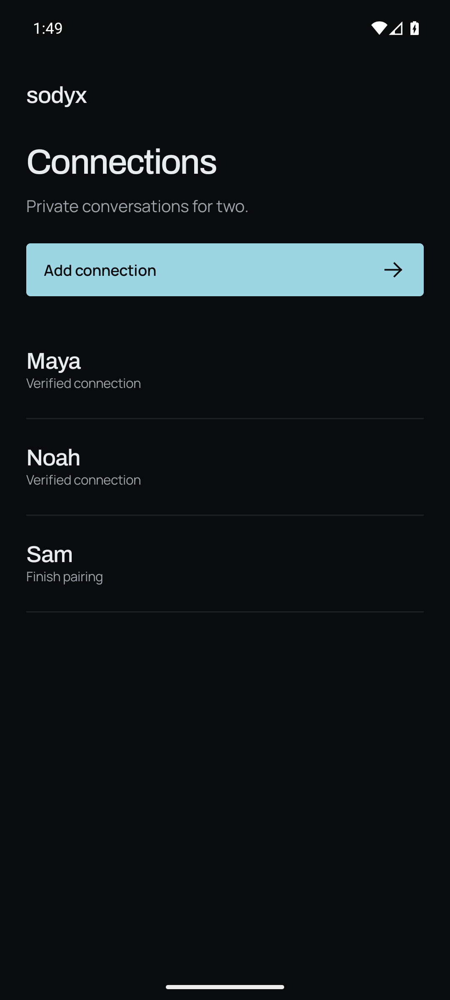
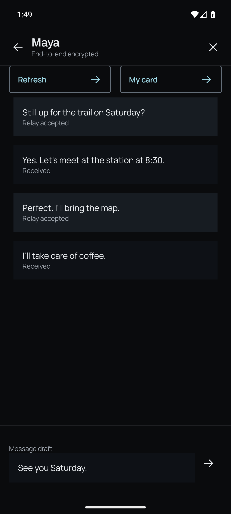
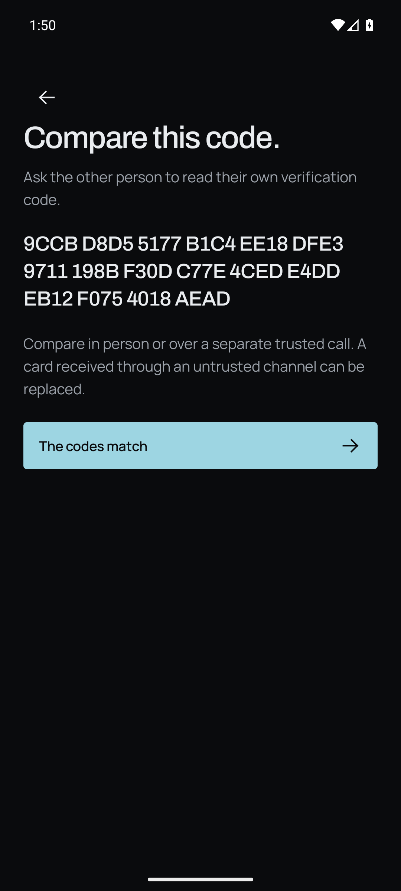

<div align="center">
  <h1>Sodyx</h1>
  <p>One-to-one messaging for Android.</p>
  <p>
    <a href="#screenshots">Screenshots</a> ·
    <a href="#start-a-conversation">Getting started</a> ·
    <a href="#build">Build</a> ·
    <a href="docs/PROTOCOL.md">Protocol</a>
  </p>
</div>

Sodyx sends encrypted text through a relay you host. Each connection has its own identity and encrypted local store. Pairing starts with an exchange of contact cards and a verification-code comparison.

## Screenshots

<table>
  <tr>
    <td align="center" width="33%"></td>
    <td align="center" width="33%"></td>
    <td align="center" width="33%"></td>
  </tr>
  <tr>
    <td align="center"><strong>Connections</strong></td>
    <td align="center"><strong>Conversation</strong></td>
    <td align="center"><strong>Verification</strong></td>
  </tr>
</table>

<sub>Captured from the Android app with sample conversations and generated verification data.</sub>

## What it does

- **Separate identities:** every connection gets a fresh libsignal identity.
- **Verified pairing:** compare the complete contact-card code through a separate trusted channel before connecting.
- **Encrypted persistence:** messages, protocol state, and relay capabilities are protected with Android Keystore-backed encryption.
- **Queued delivery:** outgoing ciphertext survives an app restart and can be retried without re-encrypting it.
- **Connection closure:** closing a connection destroys its local keys and records and revokes its relay mailbox when reachable.

The current release is text-only. Messages are retrieved while a conversation is open; there are no push notifications or read receipts. Mailbox capabilities expire after seven days. **Relay accepted** means the relay stored ciphertext, not that the recipient read it.

## Start a conversation

Use a Sodyx relay exposed through **HTTPS**. The [relay guide](relay/README.md) covers running the service, persistent storage, and its HTTP contract.

1. On both phones, choose **Add connection**, enter a local name and the relay address, and create a contact card.
2. Share each card only with the intended person. Paste their card into your connection.
3. Compare the displayed code with the code on their own phone, in person or through a separate trusted call. Choose **The codes match** after checking it.
4. Once both phones finish pairing, send messages. **Refresh** retrieves incoming messages and retries queued delivery.

**Erase and close** ends the connection on your device. Starting again requires new contact cards.

## Build

| Requirement | Version |
| --- | --- |
| JDK | 21 |
| Android SDK Platform | 36 |
| Android Build Tools | 35.0.0 |
| Minimum Android version | Android 8.0 / API 26 |
| Relay runtime | Node.js 22.17 or newer |

Set `ANDROID_HOME` or create an untracked `local.properties` with your SDK path. On Windows, use `gradlew.bat`.

```sh
# Installable debug APK for ARM64 phones
./gradlew :app:assembleDebug -Psodyx.abi=arm64-v8a

# Unsigned release APK
./gradlew :app:assembleRelease -Psodyx.abi=arm64-v8a
```

| Output | Path |
| --- | --- |
| Debug APK | `app/build/outputs/apk/debug/app-debug.apk` |
| Unsigned release APK | `app/build/outputs/apk/release/app-release-unsigned.apk` |

The debug application ID is `io.sodyx.app.debug`. Default builds include ARM64 and x86_64; use `-Psodyx.abi=x86_64` for an emulator build. Release signing is configured by the distributor, with signing material kept outside Git.

<details>
<summary><strong>Development checks</strong></summary>

```sh
./gradlew spotlessCheck :domain:test :security:testDebugUnitTest :app:testDebugUnitTest lintDebug lintRelease
npm --prefix relay test
```

The verification record includes **33 host tests, 6 relay tests, and 41 Android device tests**, covering pairing, queued delivery, tampering, replay, restart, and closure. The foreground lifecycle check was also rerun after its correction.

The live relay device test uses an ADB-reversed local relay and the `sodyx.liveRelay` instrumentation argument. See the [verification record](docs/VALIDATION.md) for the test scope and limitations.

CI checks formatting, tests, Android lint, builds, and repository history for secrets. Enable the local staged scan with `git config core.hooksPath .githooks`.

</details>

## Security boundaries

Message content is encrypted on the sender's device and decrypted by the intended peer. The relay can still observe IP connections, timing, message sizes, and mailbox activity. Sodyx does not provide an anonymity network.

Local closure cannot remove another person's retained messages, screenshots, or copied text. A compromised endpoint can also expose live content. Runtime verification used an API 36 x86_64 emulator; distributors should test their intended physical devices before release.

The protocol implementation is pinned to **libsignal 0.102.2**. Signal does not support third-party consumers or guarantee a stable API, so upgrades require compatibility testing.

## Documentation

| Document | Covers |
| --- | --- |
| [Protocol](docs/PROTOCOL.md) | Pairing, encrypted envelopes, persistence, and closure |
| [Encrypted storage](docs/CRYPTO_STORAGE.md) | Keystore protection and transaction behavior |
| [Android controls](docs/ANDROID_SECURITY.md) | Permissions, screenshots, backup, and TLS policy |
| [Verification](docs/VALIDATION.md) | Requirement-to-test evidence and known limits |
| [Relay](relay/README.md) | Service setup, capability scopes, expiry, and storage bounds |

## License

[GNU Affero General Public License v3 only](LICENSE) (`AGPL-3.0-only`). Bundled dependencies retain their own licenses and notices.
